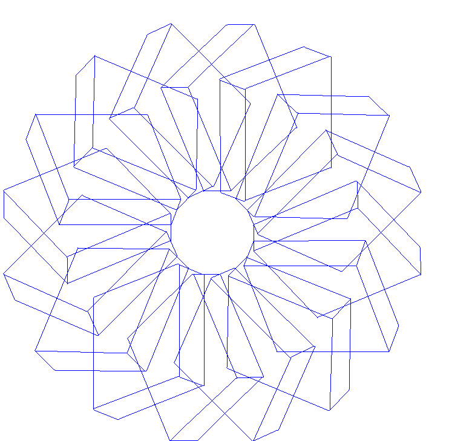
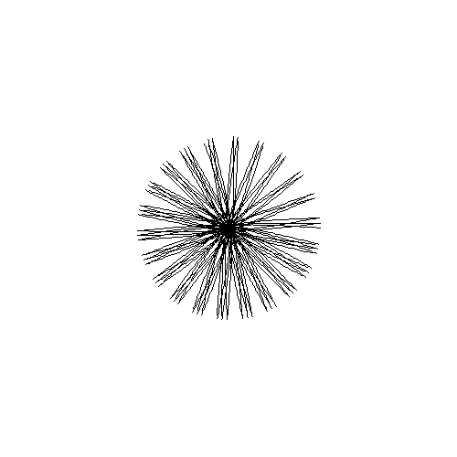

# Добро пожаловать в репозиторий

### Лабораторная работа 1

Реализовать следующие функции:

1. Вычерчивания отрезков прямых линий толщиной в 1 пиксел.
2. Вывода на экран полигона.
3. Определения типа полигона: простой или сложный (т.е. с самопересечениями),
   выпуклый или невыпуклый.
4. Заполнения полигона, используя правила even-odd и non-zero-winding определения
   принадлежности пиксела полигону.

Помимо реализации программы, студент должен подобрать набор тестовых данных,
позволяющий продемонстрировать работоспособность и корректность реализованных
функций (например, для сдачи раздела по заполнению многоугольников, необходимо
подготовить координаты вершин нескольких многоугольников, для которых правила
заполнения non-zero-winding и even-odd дают разный результат).

### Лабораторная работа 2

Реализовать следующие функции:

1. Построения кривых Безье третьего порядка.
2. Отсечения отрезков прямых выпуклым полигоном.

### Лабораторная работа 3

В данной лабораторной работе следует использовать функции, разработанные в
лабораторных работах 1 и 2.
Преобразования осуществляются над "проволочной" моделью параллелепипеда.
Реализовать следующие функции:

1. Построения параллельной проекции повернутого параллелепипеда на плоскость Z = n.
2. Построения одноточечной перспективной проекции повернутого параллелепипеда.
   Центр проекции находится в точке `[0, 0, k]`.
3. Удаления невидимых ребер "проволочной" модели параллелепипеда.
4. Анимации параллелепипеда для обоих типов проекций. Объект должен вращаться
   вокруг оси, направление которой задается радиус-вектором `[x, y, z]`.

### БДЗ

Вариант 3

1) Напишите программу, которая находит полигон, который является внешним
   контуром полигона с самопересечениями. Исходный и получившийся полигоны
   выведите на экран.
2) Реализуйте функцию, которая с помощью одной или нескольких кривых Безье 3-го
   порядка строит дугу окружности. Функция получает в качестве параметров координаты
   центра окружности, радиус окружности и значения двух углов, которые задают радиус-вектора от центра окружности до
   крайних точек дуги. Дуга строится против часовой стрелки.

### Загадка: как я ошибся, что у меня вместо круга получилась такая картинка

